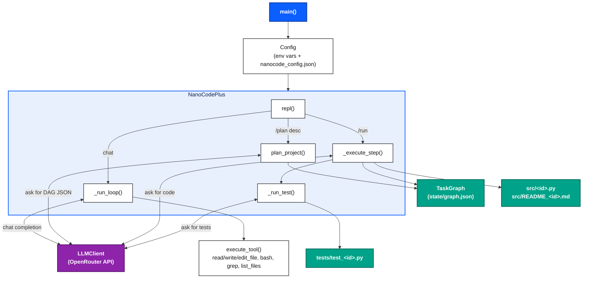

# nanocode+

A single-file terminal coding agent. It runs a tool-calling REPL against an OpenAI-compatible API (OpenRouter by default), and can optionally break a project into a dependency graph of steps, generate Python code for each step, write a short README per step, and run generated pytest tests.

---

## What it actually does

- **REPL** (`repl()`) — reads user input, dispatches slash commands, otherwise sends the message into the tool-calling loop.
- **Tool-calling loop** (`_run_loop()`) — streams a chat completion, collects any tool calls, executes them via `execute_tool()`, feeds results back, and repeats until the model stops calling tools or `max_iterations` is hit.
- **Tools** (`execute_tool()`) — `read_file`, `write_file`, `edit_file`, `bash`, `grep`, `list_files`, `todo_write`. `write_file` and `bash` ask for a `y/N` confirmation unless `auto_approve` is set.
- **Planning** (`plan_project()`) — sends the project description to the LLM, parses a JSON DAG out of the response, and builds a `TaskGraph` of `TaskNode`s.
- **Graph execution** (`_execute_graph()` / `_execute_step()`) — runs ready nodes (all dependencies completed) one at a time: generates Python code for the step, rejects output that looks like shell commands (retrying up to 3 times), writes `<node_id>.py`, writes a `README_<node_id>.md` via `ReadmeManager`, and optionally runs `_run_test()`.
- **Tests** (`_run_test()`) — asks the LLM to write pytest for the generated code, writes `test_<node_id>.py`, runs `pytest`, and returns pass/fail.
- **Config** (`Config`) — loaded from environment variables, then overridden by `nanocode_config.json` (except `api_key`, which always comes from the environment and is never written to disk).
- **Metrics** (`Metrics`) — a counter dataclass with a `record()` method. Note: nothing in the current code calls `record()`, so `tasks_completed` / `tasks_failed` / `test_pass_rate` stay at their defaults even though `/status` displays them.

That's the whole system — one process, one file, no external services beyond the LLM API.

---

## Architecture



**Legend:** blue = process entry point · purple = the one external dependency (the LLM API) · teal = files written to disk · white = functions/classes inside the single `NanoCodePlus` object.

---

## Installation

```bash
pip install openai rich python-dotenv
```

`python-dotenv` is optional — if it's not installed, the script falls back to a manual `.env` parser.

Set your OpenRouter API key (you'll be prompted for it on first run and it will be saved only to your shell environment, never to `nanocode_config.json`):

```bash
export OPENROUTER_API_KEY="sk-or-..."
```

Optional `.env`:

```
OPENROUTER_API_KEY=sk-or-...
DEFAULT_MODEL=poolside/laguna-s-2.1:free
OPENROUTER_BASE_URL=https://openrouter.ai/api/v1
WORKSPACE_DIR=.workspace
AUTO_APPROVE=false
AUTO_TEST=true
MAX_README_SIZE=5000
MAX_ITERATIONS=50
TEMPERATURE=0.7
```

## Usage

```bash
python nanocode.py [--model <name>] [--auto-approve] [--workspace <dir>]
```

### REPL commands

| Command | Does |
|---|---|
| `/plan` | Toggles plan mode — while ON, `write_file`, `edit_file`, and `bash` are blocked (returns `"Plan mode ON - writes disabled"` instead of running) |
| `/graph` | Prints the current task graph, if one exists |
| `/run` | Executes all ready graph nodes until the graph completes or nothing is ready |
| `/status` | Prints config, metrics, and the task graph |
| `/model <name>` | Switches the active model and saves it to `nanocode_config.json` |
| `/quit`, `/exit` | Exits |

Anything else typed at the prompt is sent as a chat message and handled by `_run_loop()`.

To get a task graph in the first place, you plan it via chat (there's no dedicated `/plan <description>` argument — describe the project as a normal message, or call `plan_project()` if you're scripting against the class directly) and then run `/run`.

### Example: generating a small project

Describing something like *"a CLI todo app with add/list/complete commands"* and executing the resulting graph produces files such as:

```
.workspace/src/todo_app.py
.workspace/src/README_todo_app.md
.workspace/tests/test_todo_app.py
```

> `node_todo` / `todo_app` are not part of nanocode+'s source — they're example output the agent itself generated while planning and executing a sample "todo list" project, kept as a demonstration of the planner → codegen → README → test pipeline above.

---

## Generated workspace layout

```
.workspace/
├── src/
│   ├── <node_id>.py            # code generated for that step
│   └── README_<node_id>.md     # summary/logic/variables for that step
├── tests/
│   └── test_<node_id>.py       # pytest generated for that step (if AUTO_TEST)
└── state/
    └── graph.json              # persisted TaskGraph, reloaded by /run
```

## Configuration reference

| Variable | Default | Notes |
|---|---|---|
| `OPENROUTER_API_KEY` | — | Required. Read from env only; never saved to the config file. |
| `DEFAULT_MODEL` | `poolside/laguna-s-2.1:free` | Used for chat, planning, codegen, and test generation. |
| `OPENROUTER_BASE_URL` | `https://openrouter.ai/api/v1` | Any OpenAI-compatible endpoint. |
| `WORKSPACE_DIR` | `.workspace` | Root for `src/`, `tests/`, `state/`. |
| `AUTO_APPROVE` | `false` | Skips the `y/N` prompt for `write_file` and `bash`. |
| `AUTO_TEST` | `true` | Generate + run pytest after each graph step. |
| `MAX_README_SIZE` | `5000` | Step READMEs longer than this are truncated and marked `COMPRESSED`. |
| `MAX_ITERATIONS` | `50` | Max tool-call rounds per REPL turn before giving up. |
| `TEMPERATURE` | `0.7` | Sampling temperature for chat/codegen/test calls. |

## Known limitations (as implemented)

- `Metrics.record()` is defined but never called, so `/status`'s task/retry/pass-rate numbers don't currently update.
- Shell-command detection (`_is_shell`) is a simple keyword heuristic on generated code, not a sandbox — it reduces but doesn't eliminate the chance of shell-like output being written as "Python".
- `bash` tool calls run with a 30-second timeout and no sandboxing beyond the approval prompt.
- There is no CLI flag to pass a project description directly into `plan_project()` — planning currently happens through the chat REPL.

## License

Add a license of your choice (e.g. MIT) here.
