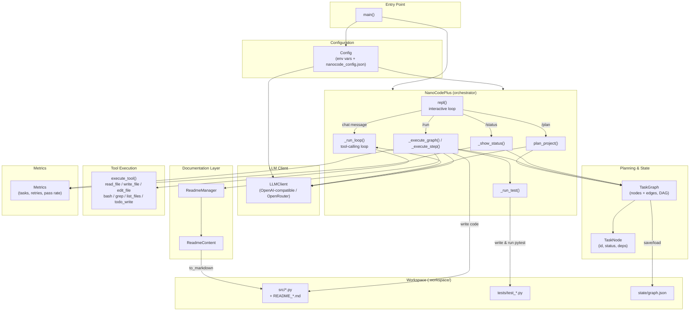

# nanocode+

A terminal-based coding agent that combines a **tool-calling REPL**, a **DAG-based project planner**, **per-step README tracking**, and **automatic test generation**. Point it at a project description and it will break the work into a dependency graph, generate Python code for each step, write a README for every step, and (optionally) generate and run tests — all while keeping enough context around that later steps know what earlier steps produced.

---

## Features

- **Interactive REPL** — chat with the agent, or hand it multi-step tasks that it plans with a `todo_write` tool call.
- **Tool-calling agent loop** — the agent can `read_file`, `write_file`, `edit_file`, `bash`, `grep`, `list_files`, and `todo_write`, streamed against an OpenAI-compatible (OpenRouter) endpoint.
- **Project planning (`/plan`)** — describe a project in natural language and the agent returns a DAG of implementation steps (`TaskGraph`).
- **Graph execution (`/run`)** — steps are executed in dependency order; each step's generated code is validated to reject shell commands disguised as Python.
- **Per-step documentation** — every completed step gets a generated `README_<node_id>.md` (`ReadmeManager` / `ReadmeContent`) summarizing its logic, variables, dependencies, and what depends on it. Downstream steps receive this as context.
- **Auto-testing** — when `AUTO_TEST=true`, pytest tests are generated and run against each step's code, and the step's status (`completed` / `failed`) reflects the result.
- **Plan mode (`/plan` toggle)** — dry-run mode that blocks `write_file`/`edit_file`/`bash` so you can preview what the agent intends to do.
- **Metrics tracking** — running counts of completed/failed tasks, retries, and test pass rate.
- **Config persistence** — settings load from environment variables and `nanocode_config.json`; the API key is always sourced from the environment and never written to disk.

---

## Architecture



**Flow summary**

1. `main()` loads `Config` (env vars override nothing; `nanocode_config.json` fills in the rest) and starts the REPL.
2. In free-chat mode, `_run_loop()` streams responses from `LLMClient`, dispatching any tool calls to `execute_tool()` and feeding results back until the model stops calling tools.
3. `/plan <description>` asks the LLM to decompose a project into a JSON DAG, which becomes a `TaskGraph` of `TaskNode`s and is persisted to `.workspace/state/graph.json`.
4. `/run` walks the graph in dependency order (`get_ready_nodes()`), generating Python code per node via `_execute_step()`, guarding against shell-command output, and writing the file to `.workspace/src/`.
5. Each completed step's rationale is captured as `ReadmeContent` and rendered to `.workspace/src/README_<node_id>.md` by `ReadmeManager`, which also supplies dependency context to downstream steps.
6. If `AUTO_TEST` is enabled, `_run_test()` generates and runs pytest tests in `.workspace/tests/`; the result marks the node `completed` or `failed`.
7. `Metrics` accumulates success/failure/retry counts, viewable via `/status`.

---

## Installation

```bash
pip install openai rich python-dotenv
```

Set your OpenRouter API key (or you'll be prompted for it on first run):

```bash
export OPENROUTER_API_KEY="sk-or-..."
```

Optionally create a `.env` file in the project directory:

```
OPENROUTER_API_KEY=sk-or-...
DEFAULT_MODEL=poolside/laguna-s-2.1:free
WORKSPACE_DIR=.workspace
AUTO_APPROVE=false
AUTO_TEST=true
MAX_README_SIZE=5000
MAX_ITERATIONS=50
TEMPERATURE=0.7
```

## Usage

```bash
python nanocode.py [--model <name>] [--auto-approve] [--workspace <dir>]
```

### REPL commands

| Command | Description |
|---|---|
| `/plan` | Toggle plan mode (blocks writes/bash so you can preview actions) |
| `/graph` | Show the current task graph |
| `/run` | Execute all ready steps in the task graph until complete |
| `/status` | Show metrics, config, and the task graph |
| `/model <name>` | Switch the active model and persist it to config |
| `/quit`, `/exit` | Exit the REPL |

Any other input is sent to the agent as a chat message and handled by the tool-calling loop.

### Example session

```
> Build a simple CLI todo app with add/list/complete commands
```

The agent plans a DAG (e.g. `data_model` → `storage` → `cli_commands` → `main_entrypoint`), then `/run` executes each node, writing files like:

```
.workspace/src/todo_app.py
.workspace/src/README_todo_app.md
.workspace/tests/test_todo_app.py
```

> **Note:** `node_todo` and `todo_app` in `.workspace/src/` are example artifacts generated *by* this CLI agent while planning and executing a sample "todo list" project — they are not part of nanocode+ itself, but sample output demonstrating the planner → codegen → README → test pipeline described above.

---

## Project structure (generated at runtime)

```
.workspace/
├── src/
│   ├── <node_id>.py            # generated implementation per graph node
│   └── README_<node_id>.md     # generated documentation per graph node
├── tests/
│   └── test_<node_id>.py       # generated pytest tests per graph node
└── state/
    └── graph.json              # persisted TaskGraph (nodes + edges)
```

## Configuration reference

| Variable | Default | Description |
|---|---|---|
| `OPENROUTER_API_KEY` | — | Required. Never persisted to `nanocode_config.json`. |
| `DEFAULT_MODEL` | `poolside/laguna-s-2.1:free` | Model used for chat and codegen. |
| `OPENROUTER_BASE_URL` | `https://openrouter.ai/api/v1` | OpenAI-compatible API base URL. |
| `WORKSPACE_DIR` | `.workspace` | Root directory for generated code/tests/state. |
| `AUTO_APPROVE` | `false` | Skip interactive confirmation for `write_file`/`bash`. |
| `AUTO_TEST` | `true` | Generate and run pytest after each step. |
| `MAX_README_SIZE` | `5000` | Max characters before a step README is compressed/truncated. |
| `MAX_ITERATIONS` | `50` | Max tool-calling iterations per REPL turn. |
| `TEMPERATURE` | `0.7` | Sampling temperature for chat/codegen calls. |

## Safety notes

- Generated code is checked with a heuristic (`_is_shell`) to reject output that looks like shell commands rather than Python, retrying up to 3 times.
- `write_file` and `bash` prompt for confirmation unless `auto_approve` is set.
- Plan mode disables all filesystem/shell side effects for previewing agent behavior.

## License

Add a license of your choice (e.g. MIT) here.
